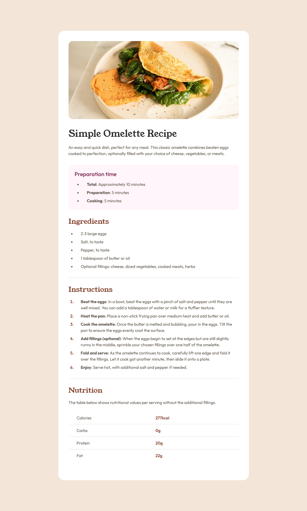

# Frontend Mentor - Recipe page solution

This is a solution to the [Recipe page challenge on Frontend Mentor](https://www.frontendmentor.io/challenges/recipe-page-KiTsR8QQKm). Frontend Mentor challenges help you improve your coding skills by building realistic projects.

## Table of contents

- [Overview](#overview)
  - [The challenge](#the-challenge)
  - [Screenshot](#screenshot)
  - [Links](#links)
- [My process](#my-process)
  - [Built with](#built-with)
  - [What I learned](#what-i-learned)
  - [Continued development](#continued-development)
  - [Useful resources](#useful-resources)
- [Author](#author)
- [Acknowledgments](#acknowledgments)

## Overview

This is a small project made with HTML and CSS. The objective was to reproduce the design of a beautiful and simplistic recipe page. It contains multiple sections, each having their importance for the recipe.

### Screenshot



### Links

- [Solution](https://github.com/Sephydev/recipe-page)
- [Live Site](https://sephydev.github.io/recipe-page/)

## My process

Firstly, I analyzed the design and I planned the different step to make this project come true.
I decided to start by the mobile design. I divided the project by its multiple section.
For each section, I started by putting the sementic HTML, and once the HTML was done for the entire section,
I started to style it with CSS.

### Built with

- Semantic HTML5 markup
- CSS custom properties
- Mobile-first workflow

### What I learned

In HTML, the most important part I learned again was the nutrition table.
It's been a long time I used a <table> tag, so doing this section was refreshing.

```html
<section class="nutrition">
  <h2>Nutrition</h2>
  <p>
    The table below shows nutritional values per serving without the additional
    fillings.
  </p>
  <table>
    <tr>
      <th>Calories</th>
      <td>277kcal</td>
    </tr>
    <tr>
      <th>Carbs</th>
      <td>0g</td>
    </tr>
    <tr>
      <th>Protein</th>
      <td>20g</td>
    </tr>
    <tr class="last-line">
      <th>Fat</th>
      <td>22g</td>
    </tr>
  </table>
</section>
```

For the CSS, I learned a new thing : How to style the marker of a list.

```CSS
ol li::marker {
    font-family: Outfit;
    color: hsl(14, 45%, 36%);
    font-weight: 600;
}
```

### Continued development

Now I know how to style list marker, I will use it when I reproduce a design, or even for personal project.
I find it very useful !

### Useful resources

- [W3School Typical Device Breakpoint](https://www.w3schools.com/howto/howto_css_media_query_breakpoints.asp) - This helped me out when I made the responsive part of the project, for the media queries.
- [MDN ::marker Article](https://developer.mozilla.org/en-US/docs/Web/CSS/::marker) - This helped me out when I was stuck for styling the marker of the <ol> list.

## Author

- Frontend Mentor - [@Sephydev](https://www.frontendmentor.io/profile/Sephydev)

## Acknowledgments

Thanks to W3School and MDN teams for their amazing article. Thanks to them, I learn and understand new things each day !
Thanks to Frontend Mentor team for their challenge and their beautiful design. Thanks to them, I can practice each day !
